# Sistema de Gestão e Fidelização — Ótica Vitturino

**Documento de especificação e memória do projeto**

Versão do documento: 2.0
Data: 19 de setembro de 2026
Fonte de verdade: código-fonte do repositório `Otica-Vitturino`

---

## Como ler este documento

Este texto tem dois públicos. A leitura não precisa ser linear.

| Se você é… | Comece por… | Objetivo |
|---|---|---|
| Dono do negócio, equipe da ótica, pessoa de fora da área de software | [Parte A — Visão do projeto](#parte-a--visão-do-projeto-para-qualquer-leitor) | Entender o que o sistema faz, para quem existe e como muda o dia a dia da ótica |
| Desenvolvedor, analista ou mantenedor de uma nova versão | [Parte B — Especificação técnica](#parte-b--especificação-técnica-para-desenvolvedores) | Implementar, corrigir e evoluir o sistema com o mesmo vocabulário e as mesmas regras |

A **Parte A** descreve o problema, as pessoas envolvidas, o que cada tela representa no atendimento e as regras de fidelização em linguagem de negócio.

A **Parte B** descreve levantamento de requisitos, fases de implementação, arquitetura, modelo de dados (MER e DER), APIs, segurança, pastas do repositório e o que ainda não foi construído.

Quando o documento original (PDF) e o código discordam, **o código implementado prevalece**. As diferenças estão registradas na seção [O que estava previsto e o que foi entregue](#15-o-que-estava-previsto-e-o-que-foi-entregue).

---

# Parte A — Visão do projeto para qualquer leitor

## 1. Em uma frase

A Ótica Vitturino deixou de acompanhar clientes só no caderno, no WhatsApp e na memória da equipe, e passou a ter um sistema digital que cuida de três coisas ao mesmo tempo: **agenda**, **produção dos óculos** e **relacionamento depois da venda**.

O aplicativo do cliente e o painel da administradora não são produtos separados. São duas portas para o mesmo serviço: a administradora organiza o trabalho da loja; o cliente acompanha o próprio atendimento com autonomia.

## 2. Por que o projeto existe

Antes do sistema, o cuidado com o cliente dependia da presença da proprietária. Lembrar aniversário, perguntar se o óculos adaptou, avisar que a armação ficou pronta e marcar limpeza gratuita eram gestos humanos — e, por isso mesmo, difíceis de repetir quando o número de clientes cresce.

O projeto nasceu para **digitalizar esse cuidado sem perder o tom pessoal**. A meta não é apenas “ter um aplicativo”. É permitir que a ótica cresça e continue tratando cada pessoa como alguém conhecido: com histórico, pontuação, mensagens no momento certo e um canal para reclamar ou elogiar.

Em termos de negócio, o sistema é um **CRM de fidelização** especializado em ótica:

- reduz o esquecimento de retornos e revisões de grau;
- torna o status da confecção visível para o cliente, em vez de exigir ligação;
- transforma indicações e comparecimento em pontos;
- concentra a operação da loja em um único painel web.

## 3. Quem usa o sistema

Existem dois papéis. Cada um tem um canal próprio de acesso.

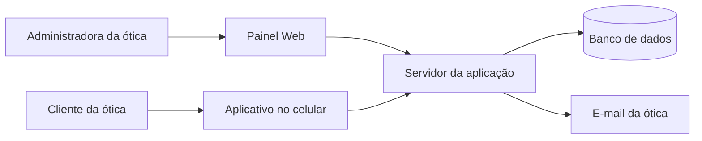

### 3.1 Administradora (painel web)

Pessoa responsável pela loja. Faz o trabalho que antes era manual: cadastrar cliente, abrir horários na agenda, confirmar quem veio, registrar um pedido de óculos, responder uma reclamação e escrever o texto das mensagens automáticas.

O acesso é pelo navegador, em computador. O aplicativo de celular **não** aceita login de administrador.

### 3.2 Cliente (aplicativo Android)

Pessoa atendida pela ótica. Não cria a própria conta: a administradora cadastra os dados na loja. Depois, o cliente entra no aplicativo com e-mail e senha, agenda um horário disponível, vê se o óculos já está pronto, registra uma ocorrência e compartilha o código de indicação.

O score (pontos) aparece no topo do aplicativo, ao lado da medalha, para o cliente sempre saber o saldo.

## 4. O que o sistema faz no dia a dia

### 4.1 Fluxo da administradora

1. Entra no painel web com e-mail e senha.
2. Cadastra o cliente (nome, e-mail, senha, telefone, endereço, data de nascimento e, se houver, código de quem indicou).
3. Abre horários livres no calendário (consulta, manutenção ou limpeza).
4. Confirma ou cancela o agendamento quando o cliente marca pelo aplicativo.
5. Cria o pedido de confecção (armação, lente, óculos de sol) e atualiza o status: realizado, em andamento ou concluído.
6. Lê ocorrências e reclamações e responde por e-mail.
7. Edita os textos da régua de relacionamento (15 dias, 30 dias, 3 meses, 6 meses, 1 ano, compra e aniversário).

### 4.2 Fluxo do cliente

1. Recebe o cadastro feito na loja e entra no aplicativo.
2. Vê o próprio nome na home e o saldo de pontos no topo.
3. Escolhe um serviço, um dia e um horário que a loja deixou disponível.
4. Acompanha o pedido em uma linha do tempo: pedido realizado → montagem → produto concluído.
5. Envia ocorrência ou reclamação e consulta o histórico.
6. Comparte o código de indicação com amigos. Quando a loja cadastra um novo cliente com esse código, o indicador ganha pontos.

### 4.3 O que acontece “sozinho”, sem ninguém clicar

O servidor envia e-mails com os textos configurados pela administradora:

- no aniversário do cliente;
- quando um pedido entra como “realizado”;
- em marcos depois de um pedido concluído (15, 30, 90, 180 e 365 dias).

Também limpa agendamentos concluídos cujo horário já passou, para o cliente poder marcar de novo.

## 5. Fidelização: a parte que diferencia o sistema de uma agenda comum

### 5.1 Régua de relacionamento

A régua é a sequência de mensagens ao longo do ciclo do óculos. O conteúdo é escrito pela administradora; o sistema só escolhe **quando** disparar.

| Momento | Intenção de negócio | Tipo técnico no sistema |
|---|---|---|
| 15 dias após pedido concluído | Pesquisa de adaptação inicial | `LEMBRETE_15_DIAS` |
| 30 dias | Suporte e orientação de uso | `LEMBRETE_30_DIAS` |
| 3 meses (90 dias) | Convite para limpeza e ajuste gratuitos | `LEMBRETE_90_DIAS` |
| 6 meses (180 dias) | Revisão intermediária de conforto | `LEMBRETE_180_DIAS` |
| 12 meses (365 dias) | Alerta de renovação de grau / recompra | `LEMBRETE_365_DIAS` |
| Pedido realizado | Confirmação da compra | `COMPRA` |
| Aniversário | Mensagem relacional, sem viés comercial | `ANIVERSARIO` |

O PDF original previa também um lembrete de 9 meses. Essa etapa **não foi implementada**.

### 5.2 Pontos (score)

Os pontos são a gamificação do relacionamento. O cliente vê o saldo no cabeçalho do aplicativo.

| Ação | Pontos | Quando o crédito acontece |
|---|---|---|
| Consulta confirmada pela administradora | +30 | Status do agendamento vai para `CONCLUIDO` |
| Manutenção confirmada | +15 | Idem |
| Limpeza confirmada | +10 | Idem |
| Indicação convertida | +50 | Novo cliente é cadastrado com o código válido do indicador |

A regra de negócio original previa converter pontos em desconto automaticamente ao atingir uma margem. **Essa conversão ainda não existe no código.** O saldo é acumulado e exibido; a tabela “X pontos = Y reais de desconto” precisa ser definida com a proprietária e implementada em versão futura.

### 5.3 Indique um amigo

Cada cliente recebe um código único no cadastro (primeiro nome em maiúsculas + 4 dígitos, por exemplo `MARIA4821`). No aplicativo, o botão “Compartilhar” abre o recurso nativo do celular com uma mensagem pronta contendo esse código. A administradora informa o código no cadastro do indicado. O sistema valida o código e credita 50 pontos ao indicador.

## 6. Mapa mental do escopo

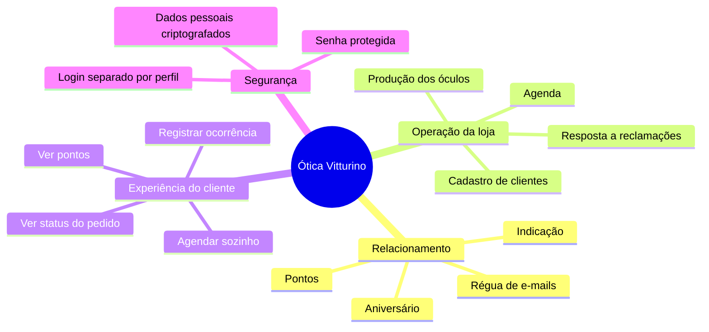

Se uma pessoa de fora da área precisar explicar o projeto em 20 segundos:

> A ótica tem um site interno para a dona organizar clientes, horários, produção e mensagens; e um aplicativo para o cliente marcar horário, ver se o óculos ficou pronto, juntar pontos e indicar amigos. O servidor cuida de avisar por e-mail nos momentos certos do ano.

---

# Parte B — Especificação técnica para desenvolvedores

## 7. Contexto do repositório

```
Otica-Vitturino/
├── DOCUMENTACAO.md          ← este documento
├── docker-compose.yml       ← orquestração de homologação/produção
├── example.env              ← modelo de variáveis de ambiente
├── WEB/
│   ├── BACK/main/           ← API Spring Boot (Java 21)
│   └── FRONT/               ← painel administrativo React + Vite
└── mobile/                  ← aplicativo Expo / React Native (cliente)
```

Três aplicações compartilham o mesmo backend REST:

| Aplicação | Pasta | Público | Porta típica |
|---|---|---|---|
| API | `WEB/BACK/main` | Consumida pelos dois clientes | `8080` |
| Painel web | `WEB/FRONT` | Administrador | `80` (Docker) ou `5173` (Vite) |
| App mobile | `mobile` | Cliente | Expo / Android |

O Nginx do frontend faz proxy das rotas da API (`/auth`, `/customer`, `/orders`, `/scheduling`, `/occurrences`, `/message-template`) para o serviço `backend:8080`. Em produção, o aplicativo pode falar com a API pelo mesmo host público.

## 8. Levantamento de requisitos

### 8.1 Atores

| Ator | Canal | Autorização Spring |
|---|---|---|
| Administrador | Web | `ROLE_ADMIN` (também recebe `ROLE_CUSTOMER` no `UserDetails`, mas o app mobile recusa perfil diferente de `CUSTOMER`) |
| Cliente | Mobile | `ROLE_CUSTOMER` |
| Sistema | Jobs agendados no backend | Não autenticado; executa no processo Spring com `@Scheduled` |

### 8.2 Requisitos funcionais — módulo administrativo (web)

| ID | Requisito | Status na implementação |
|---|---|---|
| RF01 | CRUD de clientes: cadastrar, listar, editar e excluir | Entregue em `/usuarios` + `CustomerController` / `UserService.register` |
| RF02 | Autenticação com níveis de acesso (admin × cliente) | Entregue: Spring Security + JWT, 2 horas de validade |
| RF03 | Gestão de agenda: criar e remover horários disponíveis | Entregue em `/agendamentos` |
| RF04 | Visualizar agendamentos e confirmar ou cancelar | Entregue; confirmação credita pontos e dispara e-mail |
| RF05 | Painel de status de produção (pedidos) | Entregue em `/status-producao` |
| RF06 | Central de ocorrências: ler, responder por e-mail e excluir | Entregue em `/historico-ocorrencia` |
| RF07 | Editor de templates da régua de relacionamento | Entregue em `/editor-de-mensagens` |

Cadastro de **administrador** existe no backend (`TypeProfile.ADMIN` em `POST /auth/register`). Não há tela web equivalente; o primeiro admin precisa ser criado por API ou seed.

### 8.3 Requisitos funcionais — módulo do cliente (mobile)

| ID | Requisito | Status na implementação |
|---|---|---|
| RF08 | Solicitar agendamento via calendário (consulta, manutenção, limpeza) | Entregue em `app/booking-page.jsx` |
| RF09 | Visualizar status do pedido em tempo de consulta à API | Entregue em `app/production-page.jsx` (não há WebSocket) |
| RF10 | Registrar ocorrência ou reclamação e ver histórico | Entregue em `app/incident-history.jsx` |
| RF11 | Carteira de pontos visível no header | Entregue em `components/Header.jsx` (`GET /customer/score`) |
| RF12 | Indicar um amigo com código e compartilhamento nativo | Entregue em `app/refer-a-friend.jsx` |

O cliente **não se auto-cadastra**. `POST /customer/register` exige `ROLE_ADMIN`.

### 8.4 Requisitos não funcionais

| ID | Categoria | Especificação | Status |
|---|---|---|---|
| RNF01 | Persistência | Banco relacional. Homologação e produção usam **MySQL 8.4**. Desenvolvimento pode usar H2. PostgreSQL estava no PDF original e existe como dependência Maven, mas não é o banco do `docker-compose`. | MySQL entregue |
| RNF02 | Comunicação | Mensagens transacionais por Gmail SMTP (porta 587, STARTTLS) + template Thymeleaf `confirmation-email-template.html` | E-mail entregue. Push notification **não** foi implementada |
| RNF03 | Segurança | Senha com BCrypt. Dados pessoais (nome, e-mail, telefone, endereço) com criptografia simétrica. E-mail de busca com HMAC-SHA256 (`email_lookup_hash`). JWT HMAC256 | Entregue |
| RNF04 | Interface do score | Pontos visíveis no header do aplicativo | Entregue no canto **esquerdo** do header mobile |
| RNF05 | Sessão | API stateless (`SessionCreationPolicy.STATELESS`). Token expira em 2 horas (`America/Sao_Paulo`, offset `-03:00`) | Entregue |
| RNF06 | Fuso | Toda a aplicação operacional usa `America/Sao_Paulo` | Entregue no compose (`TZ`) e nos jobs |
| RNF07 | Desconto automático por margem de pontos | Previsto no levantamento original | **Não implementado** |
| RNF08 | Performance de notificação | Previsto como push de baixa latência | Hoje o canal é e-mail; o job de lembretes está em cron a cada minuto |

### 8.5 Regras de negócio que o código realmente aplica

1. Um cliente só pode ter **um** agendamento ativo. A coluna `scheduling.customer_id` é `UNIQUE`. Se o status for `PENDENTE` ou `CONCLUIDO`, um novo agendamento é recusado. Se for `CANCELADO`, o mesmo registro é reutilizado.
2. Horário só pode ser marcado se existir em `available_slot`. Ao marcar, o slot é **apagado**. Ao cancelar, o slot é **restaurado**.
3. Pontos de agendamento só entram quando a administradora confirma (`CONCLUIDO`), não quando o cliente marca.
4. Agendamento `CONCLUIDO` cujo horário já passou é removido automaticamente (job a cada minuto e também na subida da aplicação), liberando o cliente para remarcar.
5. Código de indicação é único, gerado no cadastro, e o crédito de 50 pontos vai para o **indicador**, não para o indicado.
6. Cada tipo de mensagem da régua existe **uma única vez** (`message_template.type` é `UNIQUE`). Não há template por cliente, apesar da coluna `customer_id` existir e ser nula.
7. Resposta de ocorrência não grava texto no banco: envia e-mail e encerra.
8. Pedido com status inicial `REALIZADO` dispara o template `COMPRA`.
9. Lembretes 15/30/90/180/365 dias disparam se o cliente tiver **algum** pedido `CONCLUIDO` **e** algum pedido (qualquer status) com `order_date` mais antigo que N dias. Essa condição é ampla e deve ser revista em versão futura para evitar reenvio contínuo.
10. O aplicativo mobile recusa login se `profile !== 'CUSTOMER'`.

### 8.6 Requisitos fora de escopo da versão atual

- Autoatendimento de cadastro pelo cliente
- Aplicativo iOS publicado (o projeto Expo pode gerar iOS, mas o foco entregue é Android)
- Chat em tempo real
- Pagamento / checkout
- Prontuário oftalmológico / receita de lentes como entidade própria
- Multi-loja / multi-tenant
- Notificação push
- Conversão automática de pontos em desconto
- Histórico de múltiplos agendamentos simultâneos por cliente

---

## 9. Modelo de projeto

### 9.1 Tipo de produto

Sistema **cliente-servidor** em três camadas de implantação:

1. Interface (React web + React Native)
2. Aplicação (Spring Boot REST)
3. Dados (MySQL)

O padrão interno do backend é **MVC / layered**:

```
Controller  →  Service  →  Repository  →  Entidade JPA  →  Tabela
     ↑              ↓
   DTO          e-mail, JWT, criptografia
```

Não há camada de domínio rica (DDD). Regras ficam nos serviços. DTOs são `record` Java.

### 9.2 EAP — Estrutura analítica do projeto

```mermaid
flowchart TB
    P[Sistema Ótica Vitturino]
    P --> F1[1. Descoberta e requisitos]
    P --> F2[2. Modelagem]
    P --> F3[3. Arquitetura e infraestrutura]
    P --> F4[4. Backend]
    P --> F5[5. Painel web]
    P --> F6[6. Aplicativo mobile]
    P --> F7[7. Fidelização e comunicação]
    P --> F8[8. Segurança]
    P --> F9[9. Integração, testes e entrega]

    F1 --> F1a[Atores e fluxos]
    F1 --> F1b[RF / RNF]
    F1 --> F1c[Régua e pontuação]

    F2 --> F2a[Casos de uso]
    F2 --> F2b[MER / DER]
    F2 --> F2c[Herança JOINED]

    F3 --> F3a[Docker Compose]
    F3 --> F3b[Perfis Spring]
    F3 --> F3c[Nginx proxy]

    F4 --> F4a[Auth e usuários]
    F4 --> F4b[Agenda]
    F4 --> F4c[Pedidos]
    F4 --> F4d[Ocorrências]
    F4 --> F4e[Templates]

    F5 --> F5a[Login e rotas protegidas]
    F5 --> F5b[CRUD operacional]

    F6 --> F6a[Login cliente]
    F6 --> F6b[Agenda calendário]
    F6 --> F6c[Produção / ocorrência / indicação]

    F7 --> F7a[SMTP + Thymeleaf]
    F7 --> F7b[Jobs @Scheduled]

    F8 --> F8a[JWT]
    F8 --> F8b[BCrypt]
    F8 --> F8c[Encryptors + HMAC]

    F9 --> F9a[Testes de serviço]
    F9 --> F9b[EAS / APK]
    F9 --> F9c[Homologação]
```

### 9.3 Fases de implementação (memória do que foi construído)

Cada fase abaixo descreve **objetivo**, **o que entra**, **onde está no código** e **critério de pronto**. Use esta seção para planejar uma nova versão: preserve o contrato da fase anterior ou documente a quebra.

#### Fase 0 — Descoberta

**Objetivo.** Transformar o atendimento presencial da proprietária em regras digitais.

**Entradas.** Entrevistas / levantamento que originaram o PDF: régua de 15 dias a 12 meses, gamificação, dois canais (web admin e mobile cliente), humanização das mensagens.

**Saídas.** Lista de RF/RNF deste documento, atores, restrição “cliente não se cadastra sozinho”, decisão de um agendamento ativo por cliente.

**Critério de pronto.** Escopo fechado o suficiente para modelar entidades.

#### Fase 1 — Modelagem de dados e casos de uso

**Objetivo.** Definir entidades, herança de usuário e cardinalidades.

**Decisão estrutural.** `User` abstrato com estratégia JPA `JOINED`. `Admin` e `Customer` são especializações. Isso evita duplicar autenticação e permite `UserDetails` único no Spring Security.

**Saídas.** MER/DER da seção 12, enums de status, casos de uso da seção 10.

**Critério de pronto.** Todo caso de uso mapeia para uma tabela ou para um job.

#### Fase 2 — Backbone do backend

**Objetivo.** Subir a API autenticável.

**Entregas.**

- `MainApplication` com `@EnableScheduling` e carga de `.env`
- Entidades JPA em `model/domain`
- Repositórios Spring Data
- `UserController` (`/auth/login`, `/auth/register`)
- `SecurityConfigurations`, `SecurityFilter`, `TokenService`
- `EncryptionService` e `UserLookupService` (login por hash do e-mail, já que o e-mail em si está cifrado)

**Critério de pronto.** Login retorna JWT + `profile` + `referralCode` + `userId`.

#### Fase 3 — Módulos de negócio no backend

Ordem efetiva de construção (pelos controllers e serviços):

1. Clientes (`CustomerController` / `CustomerService`)
2. Agenda (`SchedulingController` / `SchedulingService` / `AvailableSlot`)
3. Ocorrências (`OccurrenceController` / `OccurrenceService`)
4. Pedidos (`OrderController` / `OrderService`)
5. Templates (`MessageTemplateController` / `MessageTemplateService`)

**Critério de pronto.** Cada endpoint listado na seção 13 responde com o papel correto (`ADMIN` / `CUSTOMER`).

#### Fase 4 — Painel web administrativo

**Objetivo.** Operação da loja no navegador.

**Stack.** React 19, Vite, React Router 7, CSS por página, token em `localStorage`.

**Telas e rotas.**

| Rota | Página | Capacidade |
|---|---|---|
| `/` | Login | Autenticação admin |
| `/home` | Homepage | Boas-vindas |
| `/usuarios` | Gestão de usuários | CRUD cliente + código de indicação |
| `/agendamentos` | Painel de agenda | Slots, lista, confirmar/cancelar |
| `/status-producao` | Produção | Criar pedido, mudar status, excluir |
| `/historico-ocorrencia` | Ocorrências | Ler, responder, excluir |
| `/editor-de-mensagens` | Templates | Criar/editar os 7 tipos |

Rotas internas passam por `ProtectedRoute` (presença de token). Não há checagem de `profile` no frontend web: assume-se que só o admin usa esse canal.

**Critério de pronto.** Fluxo completo da administradora sem Postman.

#### Fase 5 — Aplicativo do cliente

**Objetivo.** Autonomia do cliente no Android.

**Stack.** Expo 57, expo-router, React Native 0.86, AsyncStorage, `react-native-calendars`, EAS Build.

**Telas.**

| Arquivo | Função |
|---|---|
| `app/index.jsx` | Login (bloqueia admin) |
| `app/homepage.jsx` | Hub + guia de uso |
| `app/booking-page.jsx` | Calendário, tipo de serviço, cancelar |
| `app/production-page.jsx` | Timeline do pedido |
| `app/incident-history.jsx` | Registrar e listar |
| `app/refer-a-friend.jsx` | Share nativo |

O header busca `GET /customer/score?id={userId}` sempre que a tela ganha foco.

**Critério de pronto.** Cliente cadastrado no web consegue completar os quatro fluxos do hub.

#### Fase 6 — Comunicação e jobs

**Objetivo.** Régua automática.

**Entregas.** `SendEmailMessage`, template HTML, `MessageTemplateService.sendMessage` (`@Scheduled` cron `0 * * * * ?`, zona `America/Sao_Paulo`), disparo de aniversário e lembretes, e-mail de confirmação/cancelamento de consulta.

**Critério de pronto.** Alterar um template no web e observar o texto no e-mail enviado.

#### Fase 7 — Infraestrutura e entrega

**Objetivo.** Rodar fora da máquina do desenvolvedor.

**Entregas.**

- `docker-compose.yml`: serviços `db` (MySQL 8.4), `backend`, `frontend` (Nginx)
- Dockerfiles multi-stage (Maven 21 → JRE Alpine; Node 22 → Nginx)
- Flyway `V1.0__CREATE-DATABASE.sql` alinhado ao mapeamento JPA
- Perfis `dev` (H2), `homolog` e `prod` (MySQL)
- EAS (`mobile/eas.json`) para gerar APK, com `EXPO_PUBLIC_API_URL`

**Critério de pronto.** `docker compose up --build` sobe API + web + banco; o app aponta para o host da API.

#### Fase 8 — Endurecimento e acabamento

Itens desta fase no histórico do repositório: criptografia de PII, JWT em todas as chamadas, proxy Nginx, correção de pontos de agendamento, validação de código de indicação no cadastro, responsividade 1280×720 no web, guia de uso no mobile, modal de créditos.

### 9.4 Ordem recomendada para uma nova versão

1. Não quebrar o contrato dos endpoints da seção 13 sem versionar (`/v2`).
2. Se for permitir vários agendamentos por cliente, remover o `UNIQUE` de `scheduling.customer_id`, mudar `Customer.scheduling` de `@OneToOne` para `@OneToMany` e revisar `findReusableScheduling`.
3. Se for implementar desconto, criar entidade de resgate (não reutilizar `points` como saldo e histórico ao mesmo tempo sem ledger).
4. Se for implementar push, separar canal de notificação do `SendEmailMessage` (porta de saída).
5. Revisar o predicado `hasCompletedOrderOlderThan` antes de aumentar o volume de clientes — hoje pode reenviar lembretes todos os dias.

---

## 10. Casos de uso

### 10.1 Módulo administrativo (web)

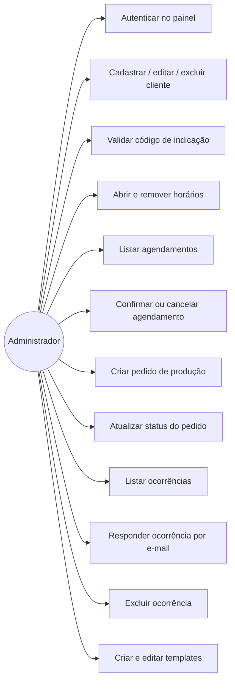

### 10.2 Módulo do cliente (mobile)

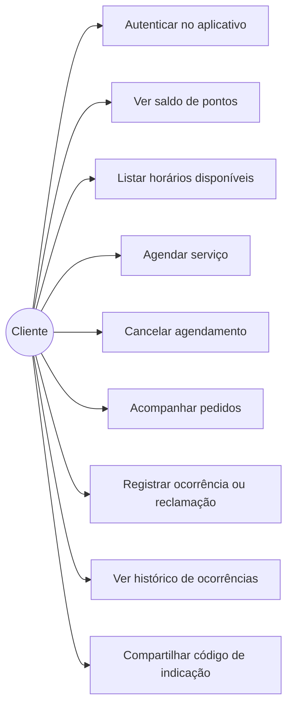

### 10.3 Sistema

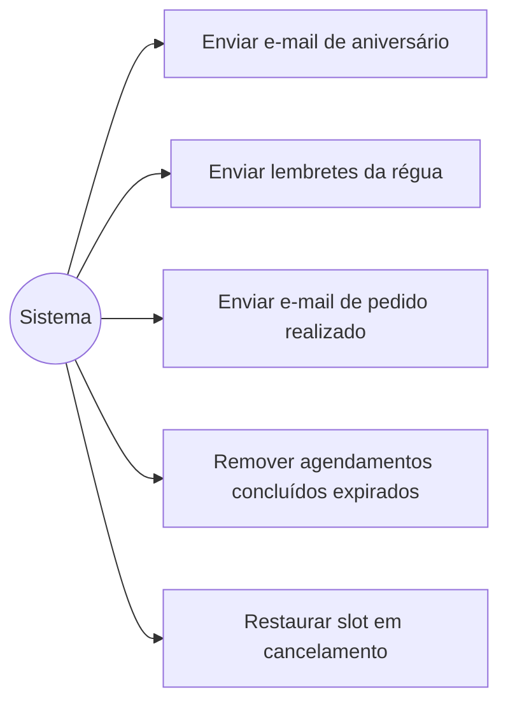

---

## 11. Fluxos de atividade

### 11.1 Login (ambos os canais)

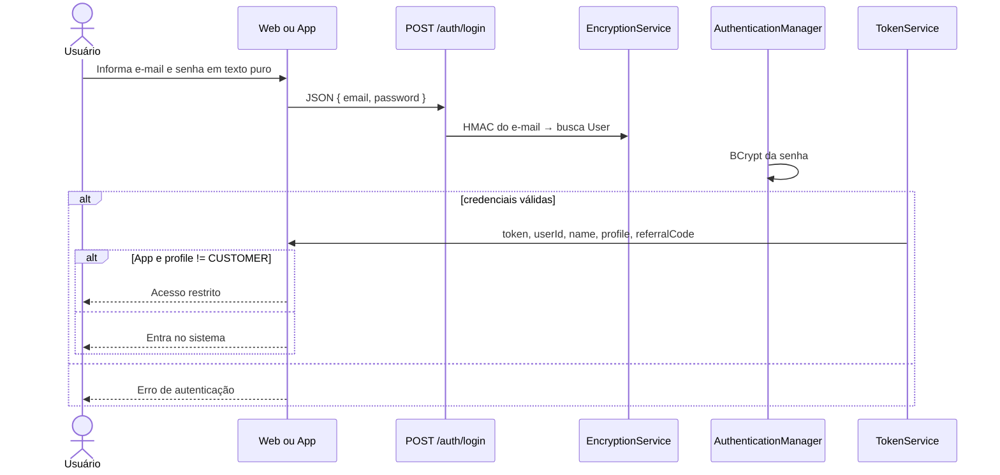

### 11.2 Cadastro de cliente pela administradora

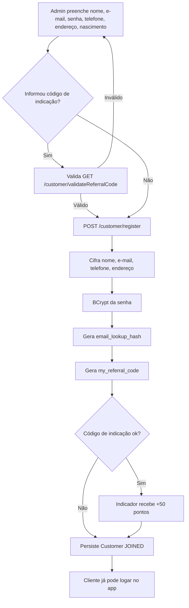

### 11.3 Agendamento ponta a ponta

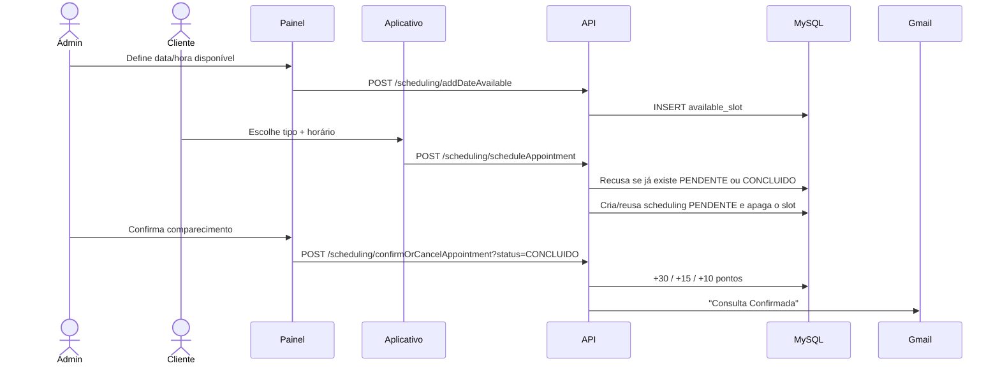

### 11.4 Produção do óculos

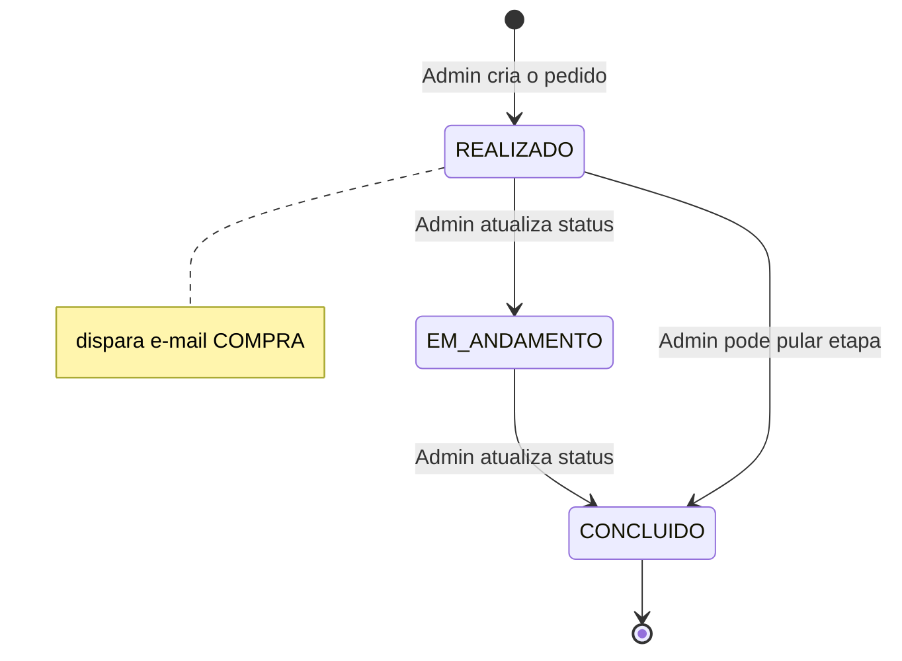

No aplicativo, a timeline só mostra etapas até o status atual. Não há polling contínuo: a lista recarrega ao focar a tela.

### 11.5 Ocorrência

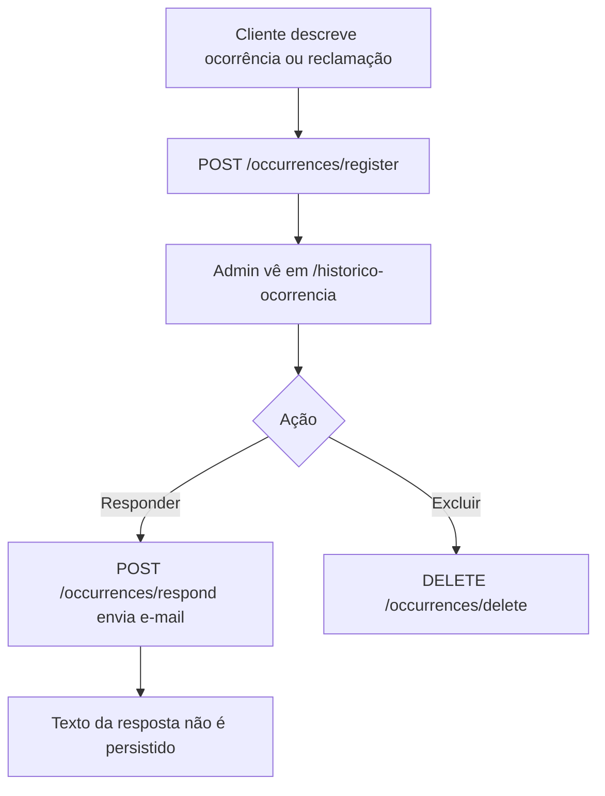

---

## 12. Arquitetura

### 12.1 Visão de implantação

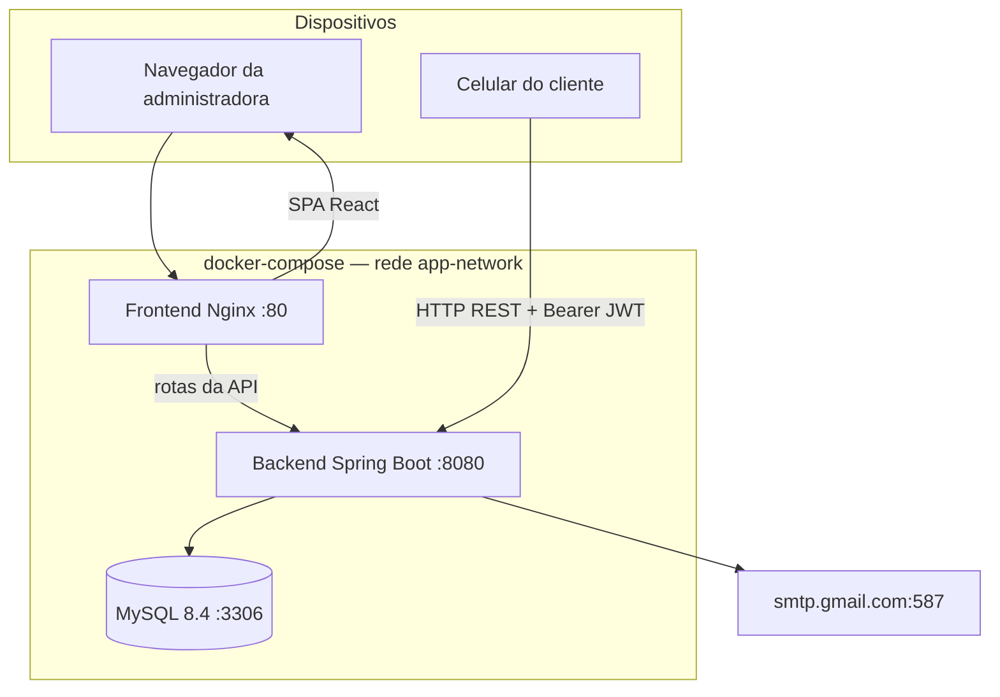

O serviço `mobile` no compose está comentado: o aplicativo não roda em container de produção; é gerado por EAS e instalado no aparelho.

### 12.2 Visão lógica do backend

Pacote-base: `com.br.oticavitturino.main`

```
main/
├── MainApplication.java
├── controller/          ← REST, um pacote por agregado
│   ├── user/
│   ├── customer/
│   ├── scheduling/
│   ├── occurrence/
│   ├── order/
│   └── message/
├── model/
│   ├── domain/          ← entidades, DTOs, enums
│   ├── repository/      ← Spring Data JPA
│   └── service/         ← regras de negócio
└── infra/
    ├── security/        ← JWT, filtro, criptografia, CORS
    ├── email/           ← SMTP + Thymeleaf
    └── exceptions/      ← @ControllerAdvice
```

Fluxo de uma requisição autenticada:

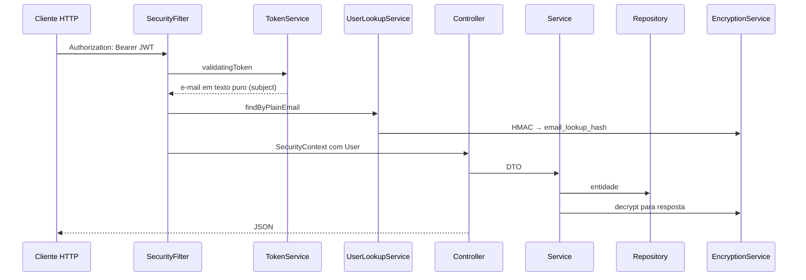

### 12.3 Stack

| Camada | Tecnologia | Versão observada no repositório |
|---|---|---|
| Linguagem da API | Java | 21 |
| Framework da API | Spring Boot | 4.0.3 (parent) |
| Persistência | Spring Data JPA + Hibernate (`ddl-auto=update`) | Flyway MySQL também presente |
| Segurança | Spring Security + Auth0 java-jwt 4.5.1 | BCrypt, JWT HMAC256 |
| Criptografia de PII | `Encryptors.text` (AES) + HMAC-SHA256 | secret + salt em env |
| E-mail | Spring Mail + Thymeleaf | Gmail SMTP |
| Banco homolog/prod | MySQL | 8.4 |
| Banco dev | H2 | console `/h2-console`, TCP 9092 |
| Painel | React 19 + Vite 8 + React Router 7 | |
| Mobile | Expo 57 + React Native 0.86 + expo-router | |
| Container | Docker Compose | backend, frontend, db |
| Build mobile | EAS | perfis development / preview / production |

### 12.4 Perfis Spring

| Perfil | Arquivo | Banco | Uso |
|---|---|---|---|
| `dev` | `application-dev.properties` | H2 (`org.h2.Driver`) | Máquina local |
| `homolog` | `application-homolog.properties` | MySQL | `SPRING_PROFILES_ACTIVE: homolog` no compose |
| `prod` | `application-prod.properties` | MySQL | Padrão de `application.properties` (`spring.profiles.active=prod`) |

Variáveis obrigatórias (ver `example.env`): `DB_URL`, `DB_USER`, `DB_PASSWORD`, `JWT_SECRET`, `ENCRYPTION_SECRET`, `ENCRYPTION_SALT`, `URL_FRONT`, `EMAIL_USERNAME`, `EMAIL_PASSWORD`, `VITE_API_URL`, `EXPO_PUBLIC_API_URL`.

`ENCRYPTION_SALT` precisa ser hexadecimal, exigência do `Encryptors.text`.

### 12.5 Segurança — contrato para novas versões

- Não persistir PII em texto puro. Campos cifrados hoje: `users.email`, `admin.name`, `customer.name`, `customer.phone`, `customer.address`.
- Busca por e-mail **sempre** via `email_lookup_hash`. Não fazer `findByEmail` com texto puro.
- Senha nunca é cifrada de forma reversível: só BCrypt.
- Endpoints públicos: `POST /auth/login` e `POST /auth/register`. Todo o restante exige JWT.
- `POST /auth/register` está `permitAll`. Isso permite criar admin sem estar autenticado. Em versão futura, restrinja a `ROLE_ADMIN` ou a um seed inicial.
- CORS atual usa `allowedOriginPatterns(List.of("*"))`. Existe `parseFrontOrigins()` a partir de `URL_FRONT`, mas ele não é aplicado na configuração de CORS em vigor. Endureça isso antes de expor em rede aberta.
- Token no web: `localStorage` chave `token`. Token no app: AsyncStorage chave `userToken`.
- Nginx precisa continuar fazendo proxy das rotas da API; senão o SPA tenta resolver `/auth/login` como arquivo estático.

### 12.6 Comunicação

Canal único implementado: **e-mail HTML**.

`SendEmailMessage.sendEmailNotification(to, subject, username, message)` preenche `templates/confirmation-email-template.html`.

Jobs:

| Método | Gatilho | Função |
|---|---|---|
| `MessageTemplateService.sendMessage` | cron a cada minuto | Aniversário + lembretes |
| `MessageTemplateService.sendBirthdayMessagesIfScheduleAlreadyPassed` | `ApplicationReadyEvent` se hora local ≥ 19:50 | Não perder aniversário se o processo subir depois do horário |
| `SchedulingService.removeExpiredCompletedSchedulings` | cron a cada minuto + `ApplicationReadyEvent` | Limpa `CONCLUIDO` vencido |

A constante `DAILY_SEND_TIME = 19:50` **não filtra** o cron de `sendMessage` (o cron é minuto a minuto). Trate isso como ponto de correção: ou o cron vira `0 50 19 * * *`, ou o método deve comparar a hora antes de enviar.

---

## 13. Modelo de dados

### 13.1 MER — entidades, atributos e chaves

Vocabulário: PK = chave primária, FK = chave estrangeira, UQ = único.

#### `users` (classe pai da herança JOINED)

| Atributo | Tipo | Restrições | Significado |
|---|---|---|---|
| `id` | BIGINT | PK, identity | Identificador compartilhado com `admin` / `customer` |
| `profile` | VARCHAR(31) | NOT NULL, CHECK `ADMIN` \| `CUSTOMER`, discriminador JPA | Papel |
| `email` | VARCHAR(512) | NOT NULL, UQ, **cifrado** | Login |
| `email_lookup_hash` | VARCHAR(64) | UQ | HMAC do e-mail normalizado |
| `password` | VARCHAR(255) | NOT NULL | Hash BCrypt |
| `active` | BOOLEAN | NOT NULL | `UserDetails.isEnabled` |
| `my_referral_code` | VARCHAR(255) | UQ | Código de indicação |
| `points` | INTEGER | default 0 | Saldo de score |

#### `admin`

| Atributo | Tipo | Restrições | Significado |
|---|---|---|---|
| `id` | BIGINT | PK e FK → `users.id` | Mesmo id da herança |
| `name` | VARCHAR(512) | NOT NULL, **cifrado** | Nome do administrador |

#### `customer`

| Atributo | Tipo | Restrições | Significado |
|---|---|---|---|
| `id` | BIGINT | PK e FK → `users.id` | Mesmo id da herança |
| `name` | VARCHAR(512) | NOT NULL, **cifrado** | Nome |
| `phone` | VARCHAR(512) | NOT NULL, **cifrado** | Telefone |
| `address` | VARCHAR(512) | NOT NULL, **cifrado** | Endereço |
| `birth_date` | DATE | NOT NULL | Aniversário e régua |

#### `available_slot`

| Atributo | Tipo | Restrições | Significado |
|---|---|---|---|
| `id` | BIGINT | PK | |
| `slot_date` | TIMESTAMP(6) | NOT NULL, UQ | Horário oferecido pela loja |

Não há FK para usuário: o slot é um recurso global da agenda.

#### `scheduling`

| Atributo | Tipo | Restrições | Significado |
|---|---|---|---|
| `id` | BIGINT | PK | |
| `scheduling_date` | TIMESTAMP(6) | NOT NULL | Data/hora marcada |
| `scheduling_type` | ENUM | `CONSULTA`, `LIMPEZA`, `MANUTENCAO` | Tipo de serviço |
| `status` | ENUM | `PENDENTE`, `CONCLUIDO`, `CANCELADO` | |
| `customer_id` | BIGINT | FK → `customer.id`, **UNIQUE** | Dono do agendamento (1:1) |

#### `occurrence`

| Atributo | Tipo | Restrições | Significado |
|---|---|---|---|
| `id` | BIGINT | PK | |
| `category` | VARCHAR(255) | NOT NULL | `ocorrencia` ou `reclamacao` (texto livre) |
| `description` | VARCHAR(255) | NOT NULL | Relato |
| `sent_at` | TIMESTAMP(6) | NOT NULL | Envio |
| `customer_id` | BIGINT | FK → `customer.id` | Autor |

Não existem colunas `resposta_admin` nem `id_admin`. A resposta vive só no e-mail.

#### `` `order` ``

A tabela se chama `order` (palavra reservada) e no JPA está anotada `` @Table(name = "`order`") ``.

| Atributo | Tipo | Restrições | Significado |
|---|---|---|---|
| `id` | BIGINT | PK | |
| `name` | VARCHAR(255) | NOT NULL | Nome do produto / serviço |
| `order_status` | ENUM | `REALIZADO`, `EM_ANDAMENTO`, `CONCLUIDO` | Produção |
| `order_date` | TIMESTAMP(6) | NOT NULL | Criação (base da régua) |
| `customer_id` | BIGINT | NOT NULL, FK → `customer.id` | Dono |

Não há FK para o administrador que criou o pedido (o PDF original cogitava essa ligação e previa removê-la; no código ela não existe).

#### `message_template`

| Atributo | Tipo | Restrições | Significado |
|---|---|---|---|
| `id` | BIGINT | PK | |
| `type` | ENUM | 7 valores, UQ | Tipo da régua |
| `template_text` | VARCHAR(1024) | NOT NULL | Texto editável |
| `customer_id` | BIGINT | NULL, **sem FK** | Não usado na lógica atual |

### 13.2 Cardinalidades

| Relação | Cardinalidade implementada | Leitura |
|---|---|---|
| User (JOINED) ↔ Admin | 1 : 0..1 | Todo admin é um user; nem todo user é admin |
| User (JOINED) ↔ Customer | 1 : 0..1 | Idem para cliente |
| Customer ↔ Scheduling | **1 : 0..1** | Um cliente tem no máximo um agendamento persistido |
| Customer ↔ Occurrence | 1 : 0..N | Várias ocorrências por cliente |
| Customer ↔ Order | 1 : 0..N | Vários pedidos por cliente |
| AvailableSlot | entidade isolada | N slots globais |
| MessageTemplate | entidade isolada | 1 linha por tipo de mensagem |

O PDF original descrevia “admin confirma agendamento” como relação Usuário ↔ Agendamento. No código, a confirmação **não grava** qual admin confirmou. O mesmo vale para resposta de ocorrência e atualização de pedido: a autorização é de papel (`ROLE_ADMIN`), não de autoria.

### 13.3 DER

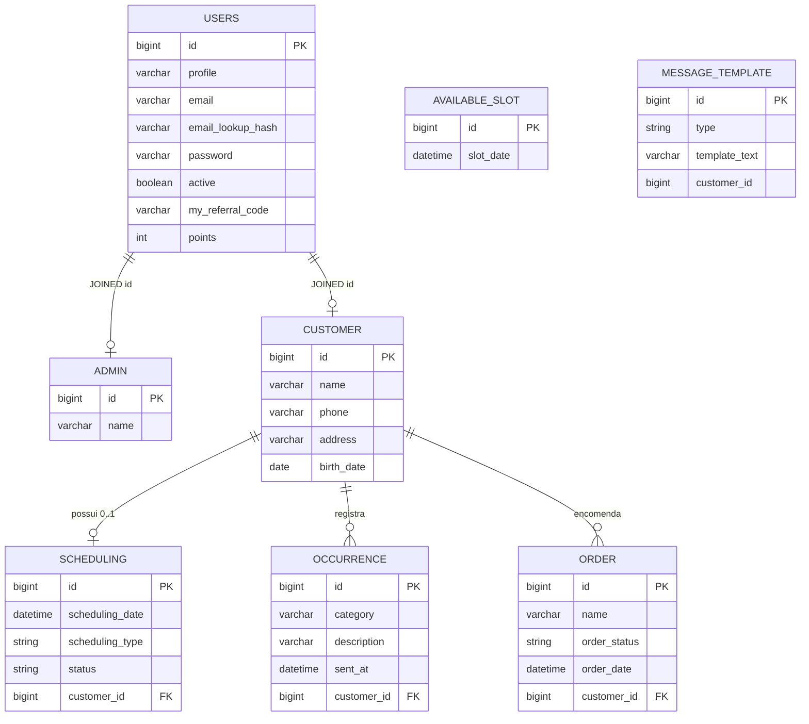

### 13.4 Diagrama de classes (domínio)

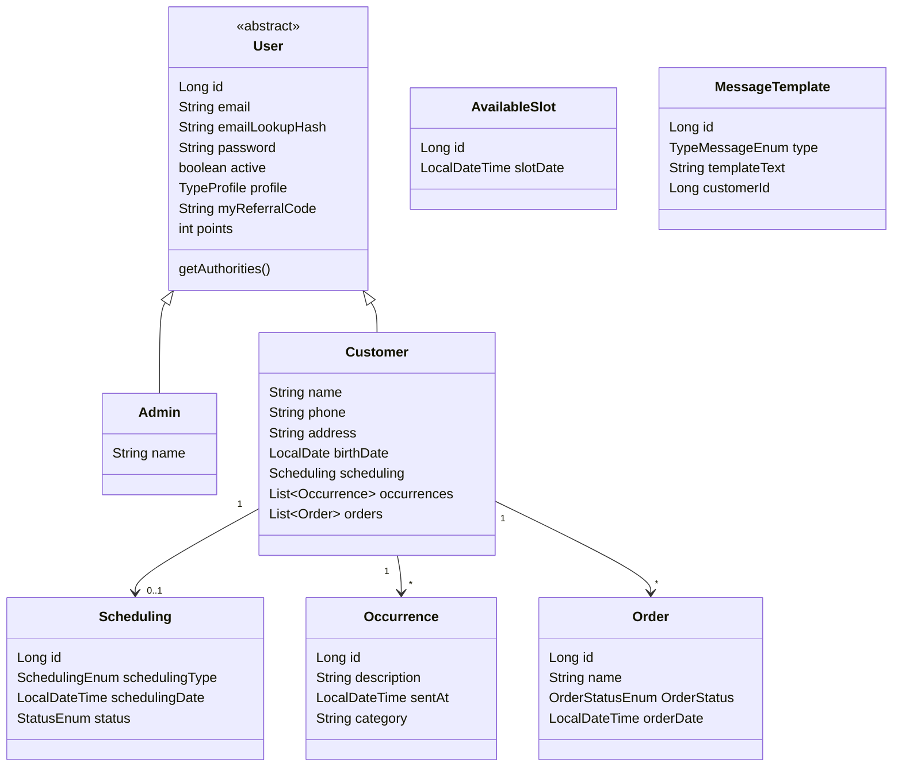

Enums de domínio:

- `TypeProfile`: `ADMIN`, `CUSTOMER`
- `SchedulingEnum`: `CONSULTA`, `MANUTENCAO`, `LIMPEZA`
- `StatusEnum`: `PENDENTE`, `CONCLUIDO`, `CANCELADO`
- `OrderStatusEnum`: `REALIZADO`, `EM_ANDAMENTO`, `CONCLUIDO`
- `TypeMessageEnum`: `LEMBRETE_15_DIAS`, `LEMBRETE_30_DIAS`, `LEMBRETE_90_DIAS`, `LEMBRETE_180_DIAS`, `LEMBRETE_365_DIAS`, `COMPRA`, `ANIVERSARIO`

### 13.5 Migração

Arquivo: `WEB/BACK/main/src/main/resources/migrations/V1.0__CREATE-DATABASE.sql`

O Hibernate também está com `spring.jpa.hibernate.ddl-auto=update`. Em versões futuras, escolha **um** dono do schema: ou Flyway (recomendado) ou `ddl-auto`. Manter os dois aumenta o risco de deriva.

---

## 14. Contrato da API

Base URL: host do backend (`http://localhost:8080` em dev; em Docker o web usa o mesmo origin via Nginx).

Autenticação: header `Authorization: Bearer <token>` em todas as rotas, exceto login e register.

### 14.1 Auth

| Método | Caminho | Papel | Corpo / query | Resposta |
|---|---|---|---|---|
| POST | `/auth/login` | público | `{ email, password }` | `{ token, referralCode, userId, name, profile }` |
| POST | `/auth/register` | público | `RegisterUserDTO` | 200 vazio |

`RegisterUserDTO`: `name`, `email`, `password`, `active`, `profile`, `phone`, `address`, `birthDate`, `referralCode`.

Para cliente, `profile` deve ser `"CUSTOMER"`. Telefone, endereço e nascimento são obrigatórios no mapeamento JPA do `Customer`.

### 14.2 Customer

| Método | Caminho | Papel | Notas |
|---|---|---|---|
| GET | `/customer/all` | ADMIN | Lista com campos descriptografados |
| GET | `/customer/score?id=` | ADMIN ou CUSTOMER | `{ points }` (`ScoreDTO`) |
| GET | `/customer/validateReferralCode?code=` | ADMIN | `{ valid: boolean }` |
| POST | `/customer/register` | ADMIN | Mesmo DTO de register |
| PUT | `/customer/update?id=` | ADMIN | `CustomerDTO` sem e-mail/senha |
| DELETE | `/customer/delete/{id}` | ADMIN | Cascade em agenda, ocorrências e pedidos |

### 14.3 Scheduling

| Método | Caminho | Papel | Notas |
|---|---|---|---|
| POST | `/scheduling/addDateAvailable` | ADMIN | Lista de `{ date_available }` |
| DELETE | `/scheduling/deleteDateAvailable` | ADMIN | `{ date_available }` |
| POST | `/scheduling/confirmOrCancelAppointment?schedulingId=&status=` | ADMIN | `status` = `CONCLUIDO` ou `CANCELADO` |
| GET | `/scheduling/getAllSchedulings` | ADMIN | |
| GET | `/scheduling/getAllDatesAvailable` | ADMIN ou CUSTOMER | |
| GET | `/scheduling/mySchedulings` | CUSTOMER | |
| POST | `/scheduling/scheduleAppointment` | CUSTOMER | `{ scheduling_type, schedulingDate }` |
| POST | `/scheduling/cancelAppointment` | CUSTOMER | corpo: id numérico do agendamento |

`SchedulingDTO`: `id`, `name`, `scheduling_type`, `schedulingDate`, `status`. Datas no JSON de entidade usam padrão `dd/MM/yyyy HH:mm:ss` (`@JsonFormat`). Confirme o formato que o frontend realmente envia ao integrar: o calendário mobile trabalha com ISO (`yyyy-MM-ddTHH:mm:ss`). Qualquer mudança de parser deve ser testada nos dois clientes.

### 14.4 Orders

`OrderController` está anotado com `@Controller` (não `@RestController`). Os métodos devolvem `ResponseEntity` e funcionam, mas o padrão do restante da API é `@RestController`. Prefira alinhar isso em refatoração.

| Método | Caminho | Papel |
|---|---|---|
| POST | `/orders/createOrder` | ADMIN |
| GET | `/orders/getAllOrders` | ADMIN |
| GET | `/orders/myOrders` | CUSTOMER |
| PUT | `/orders/modifyOrderStatus?orderId=&newStatus=` | ADMIN |
| DELETE | `/orders/deleteOrder?orderId=` | ADMIN |

`OrderDTO`: `id`, `name`, `orderStatus`, `customerId`.

### 14.5 Occurrences

| Método | Caminho | Papel |
|---|---|---|
| POST | `/occurrences/register` | CUSTOMER |
| GET | `/occurrences/occurrenceCustomer` | CUSTOMER (usa o usuário autenticado; ignora `customerId` se houver cliente logado) |
| GET | `/occurrences/listAll` | ADMIN |
| POST | `/occurrences/respond` | ADMIN — corpo `{ occurrenceId, message }` |
| DELETE | `/occurrences/delete?id=` | ADMIN ou CUSTOMER |

`OccurrenceDTO`: `id`, `description`, `sentAt`, `category`, `customerId`, `customerName`.

### 14.6 Message templates

| Método | Caminho | Papel |
|---|---|---|
| GET | `/message-template/getAllTemplates` | ADMIN |
| POST | `/message-template/create` | ADMIN — falha se o tipo já existe |
| PUT | `/message-template/update` | ADMIN — localiza pelo `type` |

`MessageTemplateDTO`: `type`, `templateText`.

### 14.7 Erros

`GlobalExceptionHandler` devolve `{ status, message }` (`RestErrorMessage`) para:

- `EmailWasRegistredException` → 400
- `DataIntegrityViolationException` → 400 genérico
- `IllegalArgumentException` → 400 com a mensagem da regra (ex.: código de indicação inválido, horário indisponível)

Falhas de autenticação seguem o padrão Spring Security (401/403).

---

## 15. O que estava previsto e o que foi entregue

| Item do PDF original | Situação atual |
|---|---|
| Banco PostgreSQL | Homologação/produção em **MySQL 8.4**. PostgreSQL só como dependência Maven |
| Arquitetura MVC | Mantida, em camadas Spring |
| Infra Hostinger | Compose genérico; host de API usado no EAS: definir por ambiente |
| Push notification | Não implementada; canal = e-mail |
| Desconto automático por pontos | Não implementado |
| Lembrete de 9 meses | Não implementado |
| Score no canto superior direito | No app, medalha e pontos estão à **esquerda** do header |
| Relação admin confirma agendamento persistida | Confirmação existe, mas sem FK de admin |
| Resposta de ocorrência persistida | Resposta só por e-mail |
| Cliente 1:1 com agendamento | Mantido (e reforçado com `UNIQUE`) |
| Wireframes de baixa fidelidade | Superados pelas telas implementadas |
| Tabela pontos × recompensa | Ainda pendente de definição com a proprietária |

---

## 16. Estrutura das interfaces

### 16.1 Web — componentes reutilizáveis

`src/components/`: `layout`, `header`, `side-menu`, `protected-route`, `container`, `card`, `input`, `button`, `list-item`, `credits-modal`.

Cliente HTTP: `src/services/api.js` (`apiFetch`, `getToken`, `setToken`, `clearToken`). Base: `VITE_API_URL`.

### 16.2 Mobile — componentes reutilizáveis

`components/`: `Header`, `Button`, `Input`, `List_Item`, `Profile_Card`, `Production_Card`, `Occurrence_Card`, `User_Guide_Card`.

Cliente HTTP: `services/api.js`. Base: `EXPO_PUBLIC_API_URL` ou `extra.apiUrl`. Timeout padrão 15 s.

Guia de uso: overlay educativo em cada tela principal. Manter esse padrão em telas novas — faz parte da humanização combinada com a proprietária.

---

## 17. Como executar

### 17.1 Preparação

1. Copie `example.env` para `.env` na raiz e preencha segredos. **Nunca commite** o `.env`.
2. `ENCRYPTION_SALT` em hex; `JWT_SECRET` e `ENCRYPTION_SECRET` longos e estáveis — mudar o secret de criptografia **invalida todos os dados cifrados** já gravados.

### 17.2 Stack completa (Docker)

Na raiz:

```bash
docker compose up --build
```

- Web: `http://localhost`
- API: `http://localhost:8080` (também via proxy do Nginx na porta 80)
- MySQL: `localhost:3306`, database `usermanagementdb`

O backend sobe com perfil `homolog`.

### 17.3 Backend local

```bash
cd WEB/BACK/main
mvn spring-boot:run
```

O `MainApplication` procura `.env` subindo diretórios a partir do working directory.

Para gerar o JAR:

```bash
mvn clean package
```

### 17.4 Frontend local

```bash
cd WEB/FRONT
npm install
npm run dev
```

Defina `VITE_API_URL` (por exemplo `http://localhost:8080`).

### 17.5 Mobile

```bash
cd mobile
npm install
npx expo start
```

No aparelho físico, `EXPO_PUBLIC_API_URL` deve ser o IP/host alcançável na mesma rede. Emulador Android usa `http://10.0.2.2` como fallback no `services/api.js`.

Build de APK interno:

```bash
eas build --platform android --profile preview
```

Há `usesCleartextTraffic: true` porque a API atual é HTTP. Antes de loja pública, publique a API em HTTPS e remova tráfego em texto puro.

### 17.6 Testes automatizados existentes

Em `WEB/BACK/main/src/test/java`:

- `MainApplicationTests`
- `UserRepositoryInheritanceTest`
- `SchedulingServiceTest`
- `OccurrenceServiceTest`
- `MessageTemplateServiceTest`

```bash
cd WEB/BACK/main
mvn test
```

Não há suíte E2E do web nem do app. Qualquer mudança de contrato (formato de data, nome de campo JSON, papel de endpoint) deve ser validada manualmente nos dois clientes.

---

## 18. Guia para evoluir o projeto

### 18.1 Onde mexer para cada tipo de mudança

| Quero… | Comece em… | Cuidado |
|---|---|---|
| Novo campo de cliente | `Customer` + DTO + tela `user-management` + criptografar se for PII | Recriar hash se o campo for usado para busca |
| Novo tipo de serviço na agenda | `SchedulingEnum` + labels no web e no mobile + pontos em `applySchedulingPoints` | Enum no MySQL exige migration |
| Vários agendamentos por cliente | Quebrar 1:1 em MER, service e UI | Hoje toda a regra cabe em `findReusableScheduling` |
| Novo marco da régua | `TypeMessageEnum` + `MESSAGE_DEFINITIONS` no editor + `sendReminderNotifications` | `type` é UNIQUE |
| Desconto por pontos | Nova entidade de ledger + regra na criação do pedido | Não decremente `points` sem histórico |
| Push | Nova porta ao lado de `SendEmailMessage` | Não misture SMTP com FCM no mesmo método |
| Novo endpoint admin | Controller + `SecurityConfigurations` + tela + `nginx.conf` se for path novo | Esquecer o Nginx quebra o web em Docker |

### 18.2 Convenções

- Pacotes em inglês (`scheduling`, `occurrence`, `order`); textos de UI em português do Brasil.
- DTOs como `record`.
- Serviços transacionais com `@Transactional`; listagens em `readOnly = true`.
- Descriptografia só na borda de resposta, nunca gravar texto puro de volta.
- Datas operacionais em `America/Sao_Paulo`.
- Nomes de status de pedido e agendamento **não** são os mesmos enums. Não reutilize `StatusEnum` em `Order`.

### 18.3 Riscos conhecidos para a próxima versão

1. **Reenvio de lembretes.** `hasCompletedOrderOlderThan` não marca “já enviado”. Com o cron atual, o volume de e-mail cresce com o tempo.
2. **`POST /auth/register` público.** Superfície para criação de admin.
3. **CORS permissivo.**
4. **Um agendamento por cliente** é fácil de quebrar na UI se o backend for alterado só de um lado.
5. **Criptografia irreversível na prática** se as chaves forem rotacionadas sem job de recifra.
6. **`OrderController` com `@Controller`.** Comportamento de serialização pode surpreender.
7. **Busca de cliente por nome cifrado** (`findByName`) em fallback de agendamento/ocorrência é incompatível com PII cifrada. O caminho autenticado (SecurityContext) é o correto; não dependa do fallback.
8. **HTTP em produção mobile.** Bloqueado em redes modernas sem `usesCleartextTraffic`.

---

## 19. Glossário

| Termo | Significado neste projeto |
|---|---|
| Score / pontos | Inteiro em `users.points`. Não é moeda até existir regra de resgate |
| Régua | Sequência de e-mails ao longo do ciclo do óculos |
| Slot | Horário que a loja oferece (`available_slot`) |
| Pedido / order | Item em produção (óculos), não pedido de e-commerce com pagamento |
| Ocorrência | Relato do cliente; categoria textual `ocorrencia` ou `reclamacao` |
| JOINED | Estratégia JPA: tabela pai `users` + tabela filha com o mesmo `id` |
| Código de indicação | `my_referral_code` do indicador, informado no cadastro do indicado |

---

## 20. Próximos passos sugeridos

Itens ainda abertos, em ordem útil de negócio:

1. Definir com a proprietária a tabela **pontos → benefício** e implementar o resgate com histórico.
2. Corrigir o agendamento dos e-mails da régua (um disparo por marco, por cliente, com registro de envio).
3. Restringir `POST /auth/register` e aplicar CORS a `URL_FRONT`.
4. Permitir histórico real de agendamentos (N por cliente) se a loja precisar remarcar sem apagar o passado.
5. Persistir resposta de ocorrência se a equipe quiser auditoria interna.
6. Publicar a API em HTTPS e gerar o app de produção sem cleartext.
7. Escolher Flyway como dono único do schema e versionar alterações de ENUM/tabela.
8. Cobrir com testes os cálculos de pontos, o 1:1 da agenda e o crédito de indicação.

---

*Este documento substitui o PDF de levantamento inicial como referência de trabalho. Mantenha-o no mesmo pull request em que o contrato da API ou a regra de negócio mudar.*
